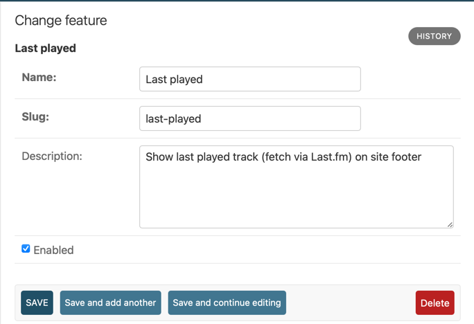

# Site feature framework

You can toggle feature flags of the website dynamically, using the Django admin panel.



Add an entry in `notcms/core/constants.py` matching the feature's slug:

```python
# notcms/core/constants.py

from enum import Enum

class SiteFeature(Enum):
    LAST_PLAYED = "last-played"
```

You can then use `notcms.core.helpers.is_feature_enabled` throughout the
application code to enable or disable behaviour, for example:

```python
from notcms.core.constants import SiteFeature
from notcms.core.helpers import is_feature_enabled

def last_played(request):
    if is_feature_enabled(SiteFeature.LAST_PLAYED):
        # Invoke the Last.fm API to get last played track
        pass
    ...
```

> [!NOTE]
> TODO: This should probably also get its own template tag.

Note that `is_feature_enabled()` is cached by default, using the caching
backend configured in Django settings. The default TTL is 60 seconds.